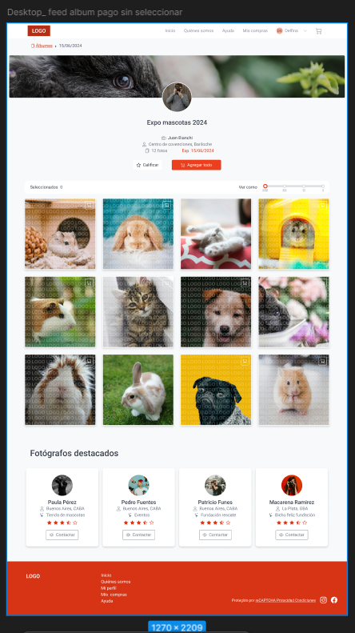

# Requerimientos

## Parte 1 Maquetación con Bootstrap

✅ Usando como referencia el prototipo de Figma proporcionado, debés maquetar una galería de fotos que sea responsive

✅ La galería debe adaptarse a los siguientes puntos de quiebre:

  ✅ Desktop: 1200px o más  **(xl)**
  
  ✅ Tablet: 768px a 1199px **(md)**
  
  ✅ Mobile: 360 a 768px. **(sm)**

## Parte 2: Implementación con React

✅ Convertí la galería de fotos en un **componente funcional** de React.

✅ La galería debe **recibir un arreglo de imágenes como props y renderizarlas dinámicamente**.

✅ Implementá un **selector** que permita cambiar la galería en 4 tipos de grillas:

  ✅ 4 fotos por fila
  
  ✅ 3 fotos por fila
  
  ✅ 2 fotos por fila
  
  ✅ 1 foto por fila.

> **Importante:** 
> - las fotos que han sido adquiridas por el usuario son las únicas que no cuentan con marca de agua.
> - Entregá esta prueba técnica enviando por mail un link público al proyecto desde tu repositorio de GitHub. No olvides dejar comentarios en el código al mail **recruitment@wearezeaze.com**
> - **Imágenes:** https://drive.google.com/drive/folders/1UCDfKBzYY2q2fMncLjtbRGGZRyR9H4fF?usp=sharing

### Ejemplo Vista Desktop


### Ejemplo Vista Mobile


## Instructions

1. Clone the repository
  ```bash
  git clone https://github.com/escuderoemanuel/emanuelescudero
  ```
2. Install dependencies
  ```bash
  npm install
  ```
3. Run the application
  ```bash
  npm run dev
  ```
